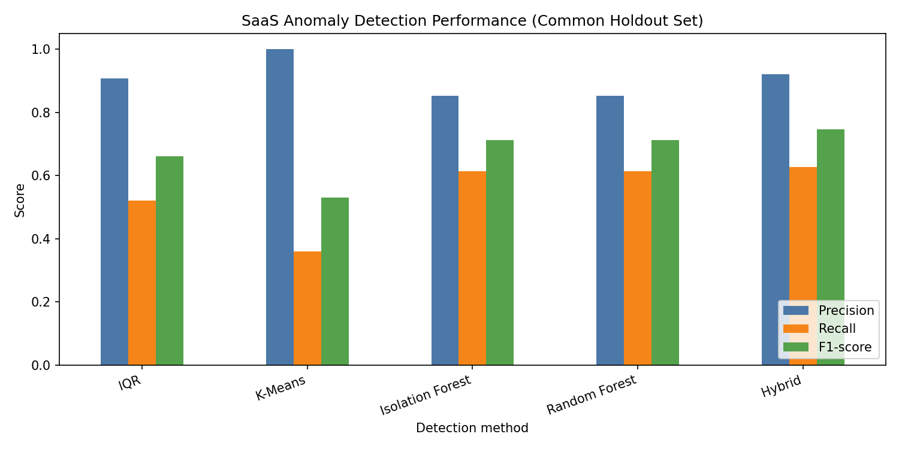

# Technical Learning Document

## SaaS Security Monitoring System with Shadow IT Detection

This is a learning guide for the code in this repository. It is not a research paper or a formal report. Values, file names, rules, and examples below come from the implemented project.

## 1. Project in One Page

The project reads two generated CSV datasets. One describes SaaS usage, such as Microsoft 365, Slack, ChatGPT, requests, uploaded data, and approval status. The other looks like a small AWS CloudTrail audit log: it records a cloud action, time, IP address, resource, and user.

```text
SaaS Activity
      |
      +--> Shadow IT / Shadow AI rules
      |
      +--> IQR / K-Means / Isolation Forest / Random Forest
                    |
                Hybrid Detection

CloudTrail-style Logs
      |
Cloud Security Detection
      |
Risk Score + Event Correlation
      |
Streamlit Dashboard
```

**SaaS activity:** `generate_data.py` creates normal and abnormal SaaS events. `detection/shadow_it.py` and `detection/shadow_ai.py` use direct approval rules. The machine-learning algorithms in `algorithms/` use three numeric activity features: requests, uploaded MB, and hour of day.

**Hybrid detection:** each ML method returns `0` for normal and `1` for suspicious. `algorithms/hybrid.py` counts the four votes. Two or more suspicious votes make the hybrid result suspicious.

**Cloud monitoring:** `detection/cloud_security.py` checks CloudTrail-style logs for an external IP, unusual time, access-key creation, API bursts, and sensitive resource access.

**Risk and correlation:** `risk/risk_score.py` assigns design weights to alert types. `correlation/event_correlation.py` combines alert records from the same user that are close in time into incidents. It also adds IP and resource context where available.

**Dashboard:** `app.py` reads generated CSV and PNG files. It does not create fake dashboard values.

### One complete implemented-style example

The generated result `INC-0200` belongs to `user_028`. It contains five related alerts between `2025-06-05 02:56` and `14:55`: unusual resource access, unknown IP, unusual access time, Shadow AI, and Shadow IT. The correlator gives it:

- Unusual Resource Access: +15
- Unknown IP: +20
- Unusual Access Time: +10
- Shadow AI: +30
- Shadow IT: +30

The sum is 105, but the code caps the score at 100, so the incident is **High** risk. Its reason includes external IP `185.220.12.24` and resource `s3://customer-exports`. The dashboard shows this in Quick Demo and Correlated Incidents.

## 2. Project Folder Structure

```text
CC_Project/
├── data/                 Generated SaaS and CloudTrail-style CSV files
├── algorithms/           IQR, K-Means, Isolation Forest, Random Forest, Hybrid
├── detection/            Shadow IT, Shadow AI, and cloud security rules
├── correlation/          Incident grouping logic
├── risk/                 Configurable risk-score logic
├── models/               Saved Random Forest model
├── results/              Metrics, alerts, incidents, predictions, chart
├── generate_data.py      Creates and validates input datasets
├── evaluate.py           Runs ML evaluation and creates comparison outputs
├── run_detections.py     Runs SaaS and cloud rule detections
├── run_correlation.py    Creates risk-scored correlated incidents
├── app.py                Streamlit dashboard
└── requirements.txt      Python package list
```

| File or folder | Input | Output | Why it exists / used by |
|---|---|---|---|
| `generate_data.py` | Fixed seed and built-in scenario definitions | `data/saas_activity.csv`, `data/cloudtrail_logs.csv` | Creates reproducible starting data; used by every later stage. |
| `data/` | Generator output | Two CSV files | Simple local storage for the project datasets. |
| `algorithms/iqr.py` | SaaS DataFrame | IQR binary predictions and bounds | Used by `evaluate.py`. |
| `algorithms/kmeans.py` | SaaS training/test data | K-Means predictions and details | Used by `evaluate.py`. |
| `algorithms/isolation_forest.py` | Unlabelled SaaS feature data | Isolation Forest predictions | Used by `evaluate.py`. |
| `algorithms/random_forest.py` | SaaS features and `ground_truth` | test predictions and trained model | Used by `evaluate.py`. |
| `algorithms/hybrid.py` | Four aligned prediction series | votes, confidence, hybrid prediction | Used by `evaluate.py`. |
| `detection/shadow_it.py` | SaaS CSV data | Shadow IT alert DataFrame | Used by `run_detections.py`. |
| `detection/shadow_ai.py` | SaaS CSV data and AI app list | Shadow AI alert DataFrame | Used by `run_detections.py`. |
| `detection/cloud_security.py` | Cloud CSV data and rule settings | cloud alert DataFrame | Used by `run_detections.py`. |
| `risk/risk_score.py` | alert-type names | score, level, contribution dictionary | Used by the correlator. |
| `correlation/event_correlation.py` | alert files plus source datasets | incident DataFrame | Used by `run_correlation.py`. |
| `models/random_forest_saas_model.joblib` | Saved by evaluation | `RandomForestClassifier` with 200 trees | Reusable trained model; its stored feature names are `requests`, `data_uploaded_mb`, and `activity_hour`. |
| `results/` | All pipeline stages | CSV, JSON, PNG, model results | The dashboard reads these artifacts. |
| `evaluate.py` | SaaS CSV | metrics, matrices, hybrid output, PNG, model | Runs stages 2–5. |
| `run_detections.py` | SaaS and cloud CSVs | alert CSVs and summary | Runs stages 6–7. |
| `run_correlation.py` | alert CSVs and source CSVs | incident CSV and summary | Runs stage 8. |
| `app.py` | `data/` and `results/` files | interactive dashboard | Stage 9 user interface. |
| `requirements.txt` | package names | install list | Used by `pip install -r requirements.txt`. |

`__init__.py` files make folders importable Python packages. No database, external cloud account, API server, container platform, attack graph, or LLM agent is implemented.

## 3. Python Environment and Libraries

Python is used because it lets the project read CSV files, calculate statistics, train standard ML models, save results, and create a dashboard with small readable programs. Writing IQR, K-Means, tree ensembles, CSV parsing, and a web UI manually would add complexity without improving this course project.

| Library | What it is and why it is used here | Where | Tiny example |
|---|---|---|---|
| Python 3 | Main programming language. It connects all pipeline stages. | Every `.py` file | `python evaluate.py` |
| pandas | A library for table-shaped data called a DataFrame. It reads CSVs, filters rows, joins data, and saves outputs. | Generator, detectors, evaluation, correlation, dashboard | `pd.read_csv("data/saas_activity.csv")` |
| NumPy | Numerical array library. | Generator and K-Means | `np.clip(value, low, high)` keeps a value inside a range. |
| scikit-learn | Machine-learning library. | `algorithms/` and `evaluate.py` | `RandomForestClassifier(n_estimators=200)` |
| matplotlib | Chart library. | `evaluate.py` | `plt.savefig("results/algorithm_performance.png")` |
| Streamlit | Simple Python dashboard framework. | `app.py` | `st.dataframe(table)` |
| joblib | Saves/loads Python ML objects. | `evaluate.py` saves the Random Forest model. | `joblib.dump(model, path)` |
| `pathlib`, `json`, `typing`, `os` | Python standard-library modules. No separate installation. | Paths, event JSON, type hints, Windows joblib setting. | `Path("results") / "algorithm_comparison.csv"` |

`requirements.txt` lists: `pandas`, `numpy`, `scikit-learn`, `matplotlib`, `streamlit`, and `joblib`.

### Virtual environment

A virtual environment is **not committed** in this repository. It is optional but recommended so the project packages do not mix with other Python projects.

```powershell
python -m venv .venv
.\.venv\Scripts\Activate.ps1
python -m pip install -r requirements.txt
```

## 4. Dataset Generation

The project uses generated data because one public dataset is unlikely to contain every required SaaS approval field and CloudTrail-style field together. The generator is not random noise: it creates stable user location, device, and internal IP relationships, then adds named abnormal scenarios.

### Fixed seed and random generation

`RANDOM_SEED = 42` creates the NumPy generator with `np.random.default_rng(42)`. A **random seed** is a starting point for pseudo-random generation. With the same code and seed, the project makes the same CSV rows again. This makes debugging and metric comparison repeatable.

### SaaS dataset: `data/saas_activity.csv`

There are 1,200 rows: 900 normal and 300 anomalous. There are 50 user profiles. Normal hours are 08:00–18:59; unusual hours are 00:00–04:59 or 22:00–23:59.

| Field | Meaning | Real example |
|---|---|---|
| `event_id` | unique SaaS record ID | `SAAS-01075` |
| `timestamp` | when the activity happened | `2025-06-01T08:25:30` |
| `user_id` | user identifier | `user_025` |
| `application` | SaaS service used | `Microsoft 365` |
| `application_category` | business category | `Productivity` |
| `requests` | number of application requests in the activity record | `41` |
| `data_uploaded_mb` | uploaded amount in MB | `1.25` |
| `device` | managed device type | `Managed macOS Laptop` |
| `location` | expected office location | `Bengaluru` |
| `approved` | whether this app is allowed | `True` |
| `ground_truth` | known evaluation label: 0 normal, 1 anomalous | `0` |

Real rows from the current CSV:

```csv
SAAS-01075,2025-06-01T08:25:30,user_025,Microsoft 365,Productivity,41,1.25,Managed macOS Laptop,Bengaluru,True,0
SAAS-00895,2025-06-01T08:33:02,user_047,OneDrive,Storage,64,784.71,Managed macOS Laptop,Pune,True,1
SAAS-00298,2025-06-01T08:35:56,user_030,Slack,Collaboration,705,6.54,Managed Windows Laptop,Hyderabad,True,1
```

The first is normal. The second has an unusually high upload. The third has unusually high requests.

### How SaaS scenarios are created

- **Normal activity:** approved applications such as Microsoft 365, Slack, Zoom, Salesforce, GitHub, and OneDrive; request count from a normal distribution centred near 55; normal upload data from a gamma distribution; normal working hour.
- **Shadow IT:** one of Notion, Dropbox, Trello, or WeTransfer; `approved=False`; `ground_truth=1`.
- **Shadow AI:** one of ChatGPT, Gemini, Claude, or DeepSeek; category `AI Assistant`; `approved=False`; `ground_truth=1`.
- **High requests:** request value from 280 to 800; `ground_truth=1`.
- **High upload:** upload value from 180 to 900 MB; `ground_truth=1`.
- **Unusual time:** timestamp is created during the unusual-hour list; `ground_truth=1`.

### Ground truth

`ground_truth` means the generator already knows whether a row was intentionally created as normal (`0`) or anomalous (`1`). It is required to calculate Precision, Recall, F1-score, false-positive rate, and confusion matrices. It is **not** used to train IQR, K-Means, or Isolation Forest. Random Forest is the supervised method, so it uses this column only after the train/test split is prepared.

### CloudTrail-style dataset: `data/cloudtrail_logs.csv`

There are 1,250 rows: 950 normal and 300 suspicious. AWS CloudTrail is an AWS audit service that records cloud actions. This project does not connect to AWS; it generates a **synthetic CloudTrail-style** CSV with a similar idea: who did what, when, from where, and on which resource.

| Field | Meaning | Real example |
|---|---|---|
| `event_id` | unique cloud audit ID | `CLOUD-01003` |
| `timestamp` | action time | `2025-06-01T03:42:54` |
| `user_id` | acting user | `user_021` |
| `event_name` | cloud action | `ConsoleLogin` |
| `resource` | resource involved | `aws:console` |
| `source_ip` | IP source of action | `10.10.1.197` |
| `region` | cloud region | `ap-south-1` |
| `status` | action status | `Success` |
| `ground_truth` | 0 normal, 1 suspicious | `1` |

Real rows:

```csv
CLOUD-01003,2025-06-01T03:42:54,user_021,ConsoleLogin,aws:console,10.10.1.197,ap-south-1,Success,1
CLOUD-01130,2025-06-01T04:41:08,user_037,ConsoleLogin,aws:console,10.10.1.197,ap-south-1,Success,1
CLOUD-00967,2025-06-01T08:00:46,user_048,GetObject,s3://customer-exports,10.10.4.165,ap-south-1,Success,1
```

Implemented suspicious cloud scenarios are unusual login time, unknown external `185.220.*.*` IP, `CreateAccessKey`, clustered API bursts, unusual S3 resources, and suspicious data access that combines an external IP, unusual time, and `s3://customer-exports`.

### Important generator lines

```python
RANDOM_SEED = 42
rng = np.random.default_rng(RANDOM_SEED)
profiles = build_user_profiles()
scenarios = ["normal"] * 900 + ["shadow_it"] * 70 + ...
rng.shuffle(scenarios)
```

1. `RANDOM_SEED` fixes repeatability.
2. `default_rng` creates the project random generator.
3. `build_user_profiles` creates stable user/location/device/IP relationships.
4. `scenarios` defines the exact number of each SaaS behaviour.
5. `shuffle` mixes these scenarios so they are not written in blocks.

## 5. Shadow IT Detection

**Shadow IT** means a person uses software that the organization has not approved. In this project, Shadow IT means an unapproved application that is **not** one of the configured AI applications.

Flow:

```text
SaaS row -> approved is False? -> application is not AI? -> Shadow IT alert
```

The result always has: `event_id`, `user_id`, `timestamp`, `alert_type`, `severity`, and `reason`. Severity is `Medium` for Shadow IT.

Real example from the output: `SAAS-00420` for `user_049` used `Trello` and produced reason `Unauthorized non-AI SaaS application: Trello`.

This is rule-based, not ML, because the approval flag already gives an exact business rule. ML would make a simple policy check less clear.

```python
ai_names = {app.casefold() for app in ai_applications}
is_unapproved = data["approved"].astype(str).str.strip().str.casefold().eq("false")
is_ai_application = data["application"].astype(str).str.casefold().isin(ai_names)
matches = data.loc[is_unapproved & ~is_ai_application].copy()
```

1. The configured AI names are converted to case-insensitive form.
2. `is_unapproved` is true only when the approval value is false.
3. `is_ai_application` marks configured AI app names.
4. `& ~` means “unapproved AND NOT AI,” which is the implemented Shadow IT definition.

## 6. Shadow AI Detection

**Shadow AI** means using an AI SaaS application without approval. The default configurable list in `detection/shadow_ai.py` is `ChatGPT`, `Gemini`, `Claude`, and `DeepSeek`.

```text
ChatGPT + approved = False -> Shadow AI
```

An alert has severity `High`. Real output includes `SAAS-00938`, where `user_028` used Claude at `2025-06-01T15:51:43`, with reason `Unauthorized AI SaaS application: Claude`.

```python
DEFAULT_AI_APPLICATIONS = ("ChatGPT", "Gemini", "Claude", "DeepSeek")
ai_names = {str(app).casefold() for app in ai_applications}
is_unapproved = data["approved"].astype(str).str.strip().str.casefold().eq("false")
is_ai_application = data["application"].astype(str).str.casefold().isin(ai_names)
matches = data.loc[is_unapproved & is_ai_application].copy()
```

1. The tuple is the default list; a caller can pass another list.
2. Names are made case-insensitive.
3. The code finds unapproved rows.
4. It finds rows whose application is in the AI list.
5. Both conditions must be true.

## 7. IQR

**IQR** means interquartile range. It is a simple statistical way to find unusually low or high values.

- **Q1:** the 25th percentile; 25% of values are at or below it.
- **Q3:** the 75th percentile; 75% of values are at or below it.
- **IQR:** `Q3 - Q1`.
- **Lower bound:** `Q1 - 1.5 × IQR`.
- **Upper bound:** `Q3 + 1.5 × IQR`.
- **Outlier:** a value below the lower bound or above the upper bound.

Small example: if Q1 is 10 and Q3 is 18, IQR is 8. Lower bound is `10 - 12 = -2`; upper bound is `18 + 12 = 30`. A value of 45 is an outlier.

Our IQR features are `requests`, `data_uploaded_mb`, and derived `activity_hour`. It copies the input DataFrame, derives hour from `timestamp`, calculates bounds, and marks a row anomalous if **any** of the three feature values is out of bounds. It returns a `pd.Series` named `iqr_prediction` containing 0 or 1.

Current all-data IQR bounds saved in `results/iqr_bounds.csv` include request upper bound `109.5`, upload upper bound `25.5513`, and activity-hour upper bound `22.5`.

```python
q1 = numeric.quantile(0.25)
q3 = numeric.quantile(0.75)
iqr = q3 - q1
outlier_by_feature = numeric.lt(bounds.loc[numeric.columns, "lower_bound"], axis="columns") | numeric.gt(
    bounds.loc[numeric.columns, "upper_bound"], axis="columns"
)
return outlier_by_feature.any(axis="columns").astype(int)
```

1. Find Q1 for each selected feature.
2. Find Q3 for each selected feature.
3. Subtract to get the IQR.
4. Check values lower than lower bound or higher than upper bound.
5. `any` means one unusual feature is enough to flag the row.

IQR is useful as a clear baseline: it has no model training and its threshold calculation is easy to explain. It cannot directly understand app approval or the meaning of an application name.

## 8. K-Means

**K-Means** is an unsupervised clustering method. A **cluster** is a group of similar rows. A **centroid** is the centre point of a cluster.

Tiny example: points `(10 requests, 2 MB)` and `(12 requests, 3 MB)` may form one normal cluster. Points `(700 requests, 5 MB)` may form another cluster. K-Means groups points by distance from centroids.

Our implementation uses the same three features as IQR and applies `StandardScaler`. Scaling gives each feature comparable influence: 700 requests should not automatically dominate just because requests are numerically larger than an hour value such as 14.

The code tries `k = 2, 3, 4, 5` and chooses the k with the best **silhouette score**. A silhouette score measures how well points fit their own cluster compared with other clusters. Current saved details choose `k=3` because scores were 0.7002, **0.7223**, 0.5643, and 0.4904. The largest cluster is treated as baseline normal behaviour. Any other cluster at least `1.25` scaled units from its centroid is anomalous.

Current all-data details: normal cluster `0` has 1,091 records; anomalous clusters `1` and `2` have 50 and 59 records.

```python
scaler = StandardScaler()
scaled = scaler.fit_transform(numeric)
selected_k, scores = choose_cluster_count(scaled)
model = KMeans(n_clusters=selected_k, random_state=42, n_init=10)
labels = model.fit_predict(scaled)
normal_cluster = int(counts.idxmax())
distances = np.linalg.norm(centroids - centroids[normal_cluster], axis=1)
```

1. Create a scaler.
2. Fit it and transform numeric features into scaled values.
3. Choose the best k from the small candidate range.
4. Create reproducible K-Means with 10 starting attempts.
5. Assign each training row to a cluster.
6. Treat the largest cluster as normal baseline.
7. Calculate every centroid’s distance from that normal centroid.

## 9. Isolation Forest

**Isolation Forest** is an unsupervised anomaly method. Its main idea is: common behaviour usually needs more random splits to isolate; unusual behaviour can often be separated quickly. Imagine repeatedly splitting request values at random: a very high request value may be separated from ordinary values early.

Our implementation uses `requests`, `data_uploaded_mb`, and `activity_hour`. It scales the features, fits `IsolationForest` with `n_estimators=200`, `contamination=0.20`, and `random_state=42`. Contamination is a chosen operating assumption that about 20% of records may be unusual; it is not learned from `ground_truth`.

The scikit-learn model returns `-1` for anomaly and `1` for normal. The project converts this to `1` suspicious and `0` normal. Current details report 240 anomalies and 960 normal rows for the all-data detector.

```python
scaled = scaler.fit_transform(numeric)
model = IsolationForest(contamination=0.20, random_state=42, n_estimators=200)
model.fit(scaled)
raw_predictions = model.predict(scaler.transform(numeric))
return pd.Series((raw_predictions == -1).astype(int), index=data.index)
```

1. Scale the three features.
2. Create a reproducible 200-tree Isolation Forest.
3. Fit it without `ground_truth`.
4. Predict `-1` or `1` on input records.
5. Convert only `-1` to project anomaly label 1.

### K-Means versus Isolation Forest

- **K-Means:** asks “which group is this record closest to?” It marks distant small/abnormal clusters.
- **Isolation Forest:** asks “is this point easy to isolate from the rest?” It does not first require a fixed cluster interpretation.

Both are unsupervised here: neither receives `ground_truth` when fitted.

## 10. Random Forest

A **decision tree** makes a sequence of simple decisions, for example: “is upload greater than 25 MB?” A **Random Forest** trains many decision trees and lets them vote. It is **supervised learning** because it learns from feature rows together with known labels.

Tiny example: if many training records with request count above 280 have label 1, several trees may learn a split around high request counts. Their final vote determines the predicted class.

Our `RandomForestClassifier` uses the three numeric features only: `requests`, `data_uploaded_mb`, and `activity_hour`. `ground_truth` is the target `y`. `train_test_split` creates 900 training and 300 test records using `test_size=0.25`, `random_state=42`, and `stratify=y`. Stratification keeps the normal/anomalous class proportion similar in both partitions.

The model uses 200 trees, `class_weight="balanced"`, and one worker. It trains only on the 900 training rows. Evaluation uses only its 300 unseen test rows. The saved `models/random_forest_saas_model.joblib` is a `RandomForestClassifier` with 200 estimators.

Current feature importance values are upload `0.4622`, requests `0.3470`, and activity hour `0.1908`. Importance is a model indication of how useful a feature was for tree splits; it is not proof of causation.

```python
X_train, X_test, y_train, y_test = train_test_split(X, y, test_size=0.25, random_state=42, stratify=y)
model = RandomForestClassifier(n_estimators=200, random_state=42, class_weight="balanced", n_jobs=1)
model.fit(X_train, y_train)
predictions = model.predict(X_test)
joblib.dump(model, MODELS_DIR / "random_forest_saas_model.joblib")
```

1. Split features and labels into train/test parts.
2. Create 200 reproducible decision trees.
3. Fit only with training features and labels.
4. Predict only the unseen test features.
5. Save the fitted model object.

The key difference is:

- **Isolation Forest:** “Is this behaviour unusual compared with the data?”
- **Random Forest:** “Based on known labelled examples, is this record class 0 or class 1?”

## 11. Hybrid Detection

One detector can miss a type of abnormal activity. The project therefore combines the different methods but does not claim that the combination is always better.

The four contributors are IQR, K-Means, Isolation Forest, and Random Forest. Each sends one binary result: 0 normal or 1 suspicious. There are no unequal weights. `minimum_votes=2` means at least two suspicious votes create a hybrid alert.

`hybrid_confidence` is `suspicious_votes / 4`. It is agreement between methods, not a calibrated probability. `results/hybrid_holdout_predictions.csv` stores ground truth, each method’s prediction, vote total, confidence, and final hybrid prediction.

Example: IQR=1, K-Means=1, Isolation Forest=0, Random Forest=1. The count is 3. Confidence is `3/4 = 0.75`; hybrid prediction is 1. If only one algorithm flags the row, confidence is 0.25 and hybrid prediction is 0.

```python
votes = pd.DataFrame({method: predictions[method] for method in REQUIRED_METHODS})
vote_count = votes.sum(axis=1).astype(int)
result["suspicious_votes"] = vote_count
result["hybrid_confidence"] = (vote_count / len(REQUIRED_METHODS)).round(2)
result["hybrid_prediction"] = (vote_count >= minimum_votes).astype(int)
```

1. Put the four prediction series into one table.
2. Add each row’s suspicious votes.
3. Save the count.
4. Divide by four to show agreement.
5. Compare the count with minimum two votes.

## 12. Model Evaluation

`evaluate.py` uses `precision_recall_fscore_support` and `confusion_matrix` from scikit-learn.

| Term | Simple project meaning |
|---|---|
| True positive (TP) | A deliberately anomalous SaaS row is flagged. |
| True negative (TN) | A normal SaaS row is not flagged. |
| False positive (FP) | A normal employee activity row is incorrectly flagged. |
| False negative (FN) | An anomalous row is missed. |
| Precision | Of the records flagged, how many were truly anomalous? `TP / (TP + FP)`. |
| Recall | Of the truly anomalous records, how many were found? `TP / (TP + FN)`. |
| F1-score | One balance of Precision and Recall. |
| False Positive Rate | Normal records incorrectly flagged divided by all actual normal records: `FP / (FP + TN)`. |
| Confusion Matrix | 2×2 table containing TN, FP, FN, TP. |
| Accuracy | Correct predictions divided by all predictions. The concept is useful, but the current code does **not** calculate or save an Accuracy column. |

For the fair comparison, Random Forest first creates the stratified holdout index. IQR bounds, K-Means, and Isolation Forest are fitted only on the other 900 training rows, then predict the same 300 holdout rows. Random Forest predicts that same holdout. This avoids fitting unsupervised models using evaluation rows.

### Actual common-holdout results

| Method | Precision | Recall | F1-score | False Positive Rate | TN | FP | FN | TP |
|---|---:|---:|---:|---:|---:|---:|---:|---:|
| IQR | 0.9070 | 0.5200 | 0.6610 | 0.0178 | 221 | 4 | 36 | 39 |
| K-Means | 1.0000 | 0.3600 | 0.5294 | 0.0000 | 225 | 0 | 48 | 27 |
| Isolation Forest | 0.8519 | 0.6133 | 0.7132 | 0.0356 | 217 | 8 | 29 | 46 |
| Random Forest | 0.8519 | 0.6133 | 0.7132 | 0.0356 | 217 | 8 | 29 | 46 |
| Hybrid | 0.9216 | 0.6267 | 0.7460 | 0.0178 | 221 | 4 | 28 | 47 |

The Hybrid has the highest F1-score on this generated holdout set. This means it found 47 of 75 anomalous holdout rows and made 4 false positive alerts. It does not prove it will be best on another dataset.

The generated chart is used directly by the dashboard:



## 13. CloudTrail-Style Log Monitoring

AWS CloudTrail is an AWS audit service. In simple words: CloudTrail records **who did what, when, from where, and on which resource**. The project uses a synthetic CloudTrail-style dataset, not real AWS CloudTrail data and not an AWS connection.

The fields record identity (`user_id`), action (`event_name`), time (`timestamp`), location/network (`source_ip`, `region`), object (`resource`), and action result (`status`). Audit logs are useful because one event can look normal, but a sequence such as external IP + unusual hour + sensitive S3 access is more meaningful.

## 14. Cloud Security Detection

`detect_cloud_security_alerts` outputs the standard alert columns. One cloud event may produce several alert rows when it breaks several rules. This is intentional: each rule describes a different signal.

| Rule | What it checks / why | Exact code behaviour | Alert |
|---|---|---|---|
| Unknown IP | External source may indicate unrecognised access. | IP must start with configured internal prefix `10.10.`. | `Unknown IP`, Medium |
| Unusual Access Time | Night activity can need review. | hour is one of 0–5, 22, or 23. | `Unusual Access Time`, Medium |
| Create Access Key | An access key can create persistent programmatic access. | `event_name == "CreateAccessKey"`. | `Create Access Key`, High |
| Abnormal API Activity | Many API calls in a short window may be automation or bulk access. | Group by `user_id` and timestamp floored to `5min`; flag count ≥3. | `Abnormal API Activity`, Medium |
| Unusual Resource Access | Finance backups/customer exports are configured sensitive resources. | resource is `s3://finance-backups` or `s3://customer-exports`. | `Unusual Resource Access`, High |

Current detection output contains 467 cloud rule alerts. `results/detection_summary.csv` shows 70 Shadow IT, 70 Shadow AI, and 467 cloud alerts.

```python
known_ip = prepared["source_ip"].astype(str).str.startswith(known_prefixes)
unusual_time = prepared["parsed_timestamp"].dt.hour.isin([0, 1, 2, 3, 4, 5, 22, 23])
access_key_rows = prepared.loc[prepared["event_name"].eq("CreateAccessKey")]
prepared["api_window"] = prepared["parsed_timestamp"].dt.floor(api_window)
api_counts = prepared.groupby(["user_id", "api_window"])["event_id"].transform("count")
resource_rows = prepared.loc[prepared["resource"].astype(str).isin(sensitive)]
```

1. Match known internal IP prefixes; invert it for unknown IPs.
2. Select the implemented non-working hours.
3. Select credential-creation actions exactly.
4. Create five-minute timestamp buckets.
5. Count each user’s events per bucket.
6. Select configured sensitive resources.

## 15. Risk Scoring

A risk score is a project prioritisation value. It helps place several alert types into Low, Medium, or High order. These values are project design choices; they are not claimed to come from a paper or external standard.

| Indicator | Points | Why it adds risk |
|---|---:|---|
| Shadow IT | +30 | unapproved non-AI SaaS use |
| Shadow AI | +30 | unapproved AI SaaS use |
| Unknown IP | +20 | source outside internal network range |
| Unusual Access Time | +10 | access outside normal working hours |
| Create Access Key | +25 | credential creation action |
| Abnormal API Activity | +10 | short-window API burst |
| Unusual Resource Access | +15 | configured sensitive resource |
| Large Data Upload | +20 | SaaS upload at least 150 MB |

The code adds applicable unique indicator types, caps the result at 100, then applies:

- 0–30: Low
- 31–60: Medium
- 61–100: High

Repeated instances of the same alert type normally count once per incident. For example, two unknown-IP alerts do not become +40 by default. `calculate_risk_score` returns `(score, level, contributions)` so the correlator can explain the score.

Example: Shadow AI (+30) + Unknown IP (+20) + Unusual Access Time (+10) + Large Data Upload (+20) = 80, therefore High.

```python
indicator_list = list(dict.fromkeys(indicators))
active_weights = dict(DEFAULT_RISK_WEIGHTS if weights is None else weights)
for indicator in indicator_list:
    if indicator in active_weights:
        contributions[indicator] = contributions.get(indicator, 0) + active_weights[indicator]
score = min(sum(contributions.values()), 100)
return score, get_risk_level(score), contributions
```

1. Remove repeated indicator names by default.
2. Choose default risk weights or caller-provided weights.
3. Check each indicator has a configured weight.
4. Add it to the contribution dictionary.
5. Sum and cap at 100.
6. Return score, risk level, and explainable contributions.

## 16. Event Correlation

**Event correlation** means grouping alerts that may be part of one security situation instead of showing every alert separately. This project uses a simple rule-based approach, not a graph database or attack graph.

The correlator combines Shadow IT, Shadow AI, and cloud alerts. It also creates `Large Data Upload` events from SaaS rows where `data_uploaded_mb >= 150.0`. Cloud alert IDs are joined to the cloud dataset to attach `source_ip` and `resource`.

Events are sorted by `user_id` and timestamp. For each user, a new incident starts when the gap from the previous event is greater than 12 hours. IP/resource do not decide membership; they are added to the reason as useful context. The returned incident columns are `incident_id`, `user_id`, `events` (JSON text), `risk_score`, `risk_level`, and `reason`.

Example based on the implemented logic:

```text
user_028
  -> Shadow AI alert
  -> cloud alert from an external IP
  -> unusual-time cloud alert
  -> sensitive S3 resource alert
  -> all consecutive alerts within 12 hours
  -> one incident with combined risk indicators
```

`INC-0200` is an actual high-risk incident demonstrating this combination. It does not include `CreateAccessKey`; that action is supported by the same correlation logic when present in an alert window.

```python
events = alert_events.merge(cloud_context, on="event_id", how="left")
large_uploads = saas_data.loc[saas_data["data_uploaded_mb"] >= large_upload_threshold_mb]
events = events.sort_values(["user_id", "parsed_timestamp", "event_id"])
if current_time - previous_time > time_window:
    yield user_events.iloc[group_start:position]
score, level, contributions = calculate_risk_score(group["alert_type"])
```

1. Join cloud IP/resource fields using event ID.
2. Add large-upload events above 150 MB.
3. Sort all security signals by user and time.
4. Start a new group after a gap larger than 12 hours.
5. Score the alert types inside each group.

Current `results/incident_summary.csv` has 291 Low, 72 Medium, and 20 High incidents.

## 17. Streamlit Dashboard

**Streamlit** lets a Python script create a small interactive web dashboard without building separate HTML, JavaScript, server routes, or a database. It fits this project because the goal is a readable course demonstration.

`app.py` uses `@st.cache_data` to avoid repeatedly reading unchanged CSV files. `load_project_data()` checks for all required files. If a file is missing, the dashboard shows the actual commands needed to create it instead of displaying placeholder values.

| Dashboard section | What it shows | Actual data source |
|---|---|---|
| Overview | six summary cards, risk-level bar chart, top three incident demo | both data CSVs, alert CSVs, incident CSV |
| Algorithm Comparison | Precision, Recall, F1, FPR table and PNG chart | `algorithm_comparison.csv`, `algorithm_performance.png` |
| Shadow IT / Shadow AI | alert tables joined with original SaaS application details | alert CSVs + `saas_activity.csv` |
| Cloud Security | filterable cloud alert table joined with event, resource, IP, region, status | cloud alert CSV + `cloudtrail_logs.csv` |
| Correlated Incidents | filterable incident table with score, level, reason, events | `correlated_incidents.csv` |
| Event Details | selected alert JSON or selected incident event JSON | alert CSVs + incident CSV |
| Project Conclusion | high-risk count and highest-F1 method | incident CSV + comparison CSV |

The overview risk bar chart is count of `Low`, `Medium`, and `High` values in `correlated_incidents.csv`. The algorithm chart is created by `evaluate.py` from the real comparison metrics and saved as a PNG.

```python
@st.cache_data
def load_csv(path):
    return pd.read_csv(path)

metrics[2].metric("Shadow IT", len(data["shadow_it"]))
risk_counts = data["incidents"]["risk_level"].value_counts()
st.bar_chart(risk_counts)
st.image(str(chart_path), caption="Precision, recall, and F1-score by detection method.")
```

1. Cache file reads for speed.
2. Read a real alert count for the card.
3. Count actual risk-level values.
4. Draw a basic Streamlit chart.
5. Display the generated performance chart if it exists.

## 18. Complete Data Flow

Consider this representative implemented path:

```text
1. Generator creates a row: user uses unauthorized ChatGPT.
2. SaaS CSV stores approved=False and ground_truth=1.
3. Shadow AI rule checks the configured AI list plus approved=False.
4. It creates a High Shadow AI alert.
5. ML algorithms separately examine requests, upload MB, and hour.
6. If at least two ML methods return 1, hybrid_prediction becomes 1.
7. A cloud row for the same user can contain external IP, unusual time, or a sensitive S3 resource.
8. Cloud rules create their own structured alerts.
9. Correlation groups consecutive same-user alerts within 12 hours.
10. Risk scoring sums unique alert-type weights and caps at 100.
11. The incident and all source alerts are saved as CSV/JSON text.
12. Streamlit reads those saved files and displays the incident and details.
```

Important detail: SaaS ML detection and cloud-rule detection are separate paths. The correlator is the component that brings their alerts together by user and time.

## 19. Why Each Technology Was Chosen

| Technology | Why we use it |
|---|---|
| Python | Clear main implementation language for data, ML, files, and UI. |
| pandas | Reads/writes CSV, filters alerts, joins event context, computes group counts. |
| NumPy | Generates numeric data and calculates K-Means centroid distances. |
| scikit-learn | Provides StandardScaler, KMeans, IsolationForest, RandomForestClassifier, split, and metrics. |
| matplotlib | Creates the saved algorithm performance PNG. |
| Streamlit | Builds the simple interactive dashboard in one Python file. |
| joblib | Saves the trained Random Forest model. |
| CSV | Easy local storage that is readable in VS Code and spreadsheet software. |
| JSON text | Stores variable-length incident event details inside a CSV field. |

## 20. How to Run the Project

1. Open the `CC_Project` folder in VS Code.
2. Optional: create and activate a virtual environment.

```powershell
python -m venv .venv
.\.venv\Scripts\Activate.ps1
```

3. Install dependencies.

```powershell
python -m pip install -r requirements.txt
```

4. Generate and validate datasets.

```powershell
python generate_data.py
```

5. Run ML algorithms, hybrid predictions, metrics, chart, and model saving.

```powershell
python evaluate.py
```

6. Run Shadow IT, Shadow AI, and cloud rules.

```powershell
python run_detections.py
```

7. Run risk scoring and event correlation.

```powershell
python run_correlation.py
```

8. Start the dashboard, then open the local URL printed by Streamlit.

```powershell
streamlit run app.py
```

## 21. How to Modify / Experiment

| What to change | Where | Effect |
|---|---|---|
| Number of users | `range(1, 51)` in `build_user_profiles()` | Changes available user IDs and their repeating office/device/IP assignments. |
| Number of SaaS/cloud records or anomaly mix | `scenarios = ...` lists in `generate_data.py` | Changes class balance, amount of data, and later metric difficulty. |
| Applications/categories | `AI_APPLICATIONS`, `APP_CATEGORIES`, `UNAPPROVED_APPS` in generator; `DEFAULT_AI_APPLICATIONS` in Shadow AI detector | Changes which app names appear and which names are treated as AI. Keep generator and detector lists aligned for clear demonstrations. |
| Random reproducibility | `RANDOM_SEED = 42` | A new seed makes a different generated dataset and different output metrics. |
| IQR features/bounds | `DEFAULT_FEATURES` and `1.5 * iqr` in `algorithms/iqr.py` | More features/rules can catch more patterns; changing multiplier changes sensitivity. |
| K-Means candidate clusters | `candidates=(2, 3, 4, 5)` in `kmeans.py` | Allows different possible cluster counts; silhouette score chooses among them. |
| K-Means anomaly distance | `distance >= 1.25` in `kmeans.py` | Smaller threshold flags more clusters; larger threshold is stricter. |
| Isolation Forest parameters | `contamination=0.20`, `n_estimators=200` in `isolation_forest.py` | Contamination controls expected anomaly fraction; estimators controls number of trees. |
| Random Forest parameters | `n_estimators=200`, `class_weight="balanced"`, `test_size=0.25` in `random_forest.py` | Changes model capacity, class handling, and evaluation split size. |
| Cloud internal IP/resource rules | `DEFAULT_KNOWN_IP_PREFIXES`, `DEFAULT_SENSITIVE_RESOURCES`, `api_window`, `api_event_threshold` in `cloud_security.py` | Changes what counts as unknown, sensitive, or an API burst. |
| Risk weights | `DEFAULT_RISK_WEIGHTS` in `risk/risk_score.py` | Changes incident priority, not the original detections. |
| Correlation window/upload threshold | `time_window_hours=12`, `large_upload_threshold_mb=150.0` in `event_correlation.py` | Larger window groups more alerts; lower upload threshold creates more large-upload events. |

After changing generation, detection, algorithm, or scoring settings, rerun the complete pipeline so `results/` and dashboard values match the code.

## 22. Important Terms Cheat Sheet

| Term | Meaning in this project |
|---|---|
| Cloud Computing | Using computing services such as storage, identity, and servers through cloud platforms. |
| SaaS | Software as a Service; software accessed online, such as Slack or ChatGPT. |
| SaaS Application | One online software service listed in the SaaS dataset. |
| Shadow IT | Unapproved non-AI SaaS use. |
| Shadow AI | Unapproved use of a configured AI SaaS app. |
| Audit Log | A timestamped record of an action. |
| CloudTrail | AWS audit-log service; this project uses CloudTrail-style generated data. |
| API | Application Programming Interface; cloud actions such as `GetObject` can be API calls. |
| Anomaly | Behaviour that differs from the expected pattern. |
| Outlier | A numeric value unusually far from typical values. |
| IQR | Interquartile range, a statistical outlier method. |
| K-Means | Algorithm that places similar rows into clusters. |
| Isolation Forest | Algorithm that finds points easy to isolate. |
| Random Forest | Many decision trees voting on a supervised class prediction. |
| Supervised Learning | Learning with known target labels, used by Random Forest. |
| Unsupervised Learning | Finding patterns without labels, used by K-Means and Isolation Forest. |
| Feature | Input value used by a model, such as requests or upload MB. |
| Label | The value a supervised model learns to predict. |
| Ground Truth | Known generated normal/anomalous label used for evaluation. |
| Training Data | Records used to fit a model. |
| Testing Data | Held-out records used to measure a trained model. |
| Precision | How often a raised alert is correct. |
| Recall | How many true suspicious records are found. |
| F1-score | Balance of Precision and Recall. |
| False Positive | Normal activity incorrectly flagged. |
| False Negative | Suspicious activity missed. |
| Risk Score | Project-defined number used to prioritize an incident. |
| Event Correlation | Grouping related alert records into one incident. |
